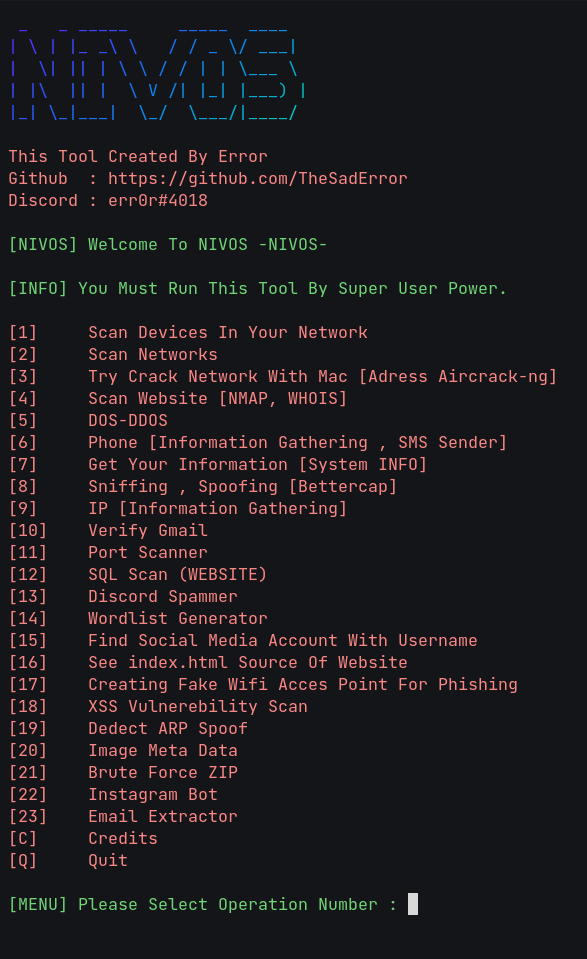

# NIVOS  <p><a href="https://github.com/TheSadError"></a><a href="https://www.youtube.com/channel/UCUfTuo3-85qD_7v1n-W98rw"></a></p>
## Information Gathering And Scan Tool
Contact : https://discord.gg/QJAj3CUB (Solo Community)

<div>
  <p align="center">
     
  </p>
</div>


NIVOS is a hacking tool that allows you to scan deeply , crack wifi, see people on your network. It applies to all linux operating systems. And it is improving every day, new packages are added. Thank You For Using NIVOS :> [NIVOS Created By NIVO Team]

## Installation & Setup
```
pip install os
git clone https://github.com/TheSadError/NIVOS
cd NIVOS
sudo python3 setup.py
```
## Run
```
cd NIVOS
sudo python3 main.py
```

## Information Of Tool
```
Error's Discord  : err0r#4018
Januie's Discord : Jan20🇦🇿#6757
```
### Still Upgrading.
```
[1]     Scan Devices On Your Network                                                     (By Error)
[2]     Scan Networks                                                                    (By Error)
[3]     Crack Network With Mac Adress                                                    (By Error)
[4]     Scan Website Vulnerabilities And Deeply Information Of Website                   (By Error)
[5]     DOS-DDOS Tool                                                                    (By Error)
[6]     Phone Info Tool                                                                  (By Error)
[7]     System INFO                                                                      (By Error)
[8]     Sniffing , Spoofing                                                              (By Error)
[9]     IP Information Gathering                                                         (By Error)
[10]    Email Verifier                                                                   (By Error)
[11]    Port Scanner                                                                     (By Error)
[12]    SQL Injection Scanner                                                            (By Error)
[13]    Discord Spammer                                                                  (By Error)
[14]    Wordlist Generator                                                               (By Error)
[15]    Find Social Media Account With Username                                          (By Error)
[16]    See index.html Source Of Website                                                 (By Error)
[17]    Creating Fake Wifi Acces Point For Phishing                                      (By Error)
[18]    XSS Vulnerebility Scan                                                           (By Error)
[19]    Dedect ARP Spoof                                                                 (By Error)
[20]    Image Meta Data                                                                  (By Error)
[21]    Brute Force ZIP                                                                  (By Error)
[22]    Instagram Bot                                                                    (By Januie)
[23]    Email Extractor                                                                  (By Error)
[24]    Password Generator                                                               (By Januie)
[C]     Credits
[Q]     Quit

[Added Strongest Anonymous DDOS Scripts For Wanters. In python. If you want you can use it. But scripts is not in menu. Just in repo folder.
in ./scripts folder you can find them. These Scripts Are For Educational Purposes! 
]
.
.
.
```
**Donation :**
```
TR05 0006 2000 0280 0009 0525 31
Name : Teymur Ahmetzade
USD Type
```
## Created : April 21 2022 [21.04.2022]

# For Educational Purposes
